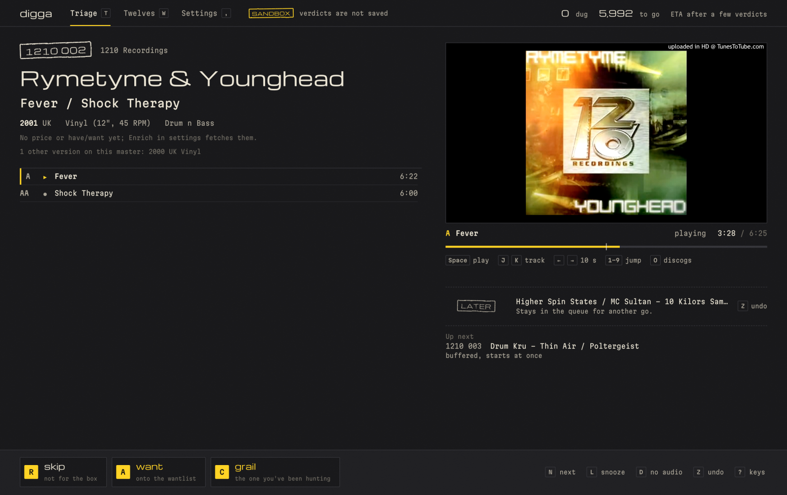
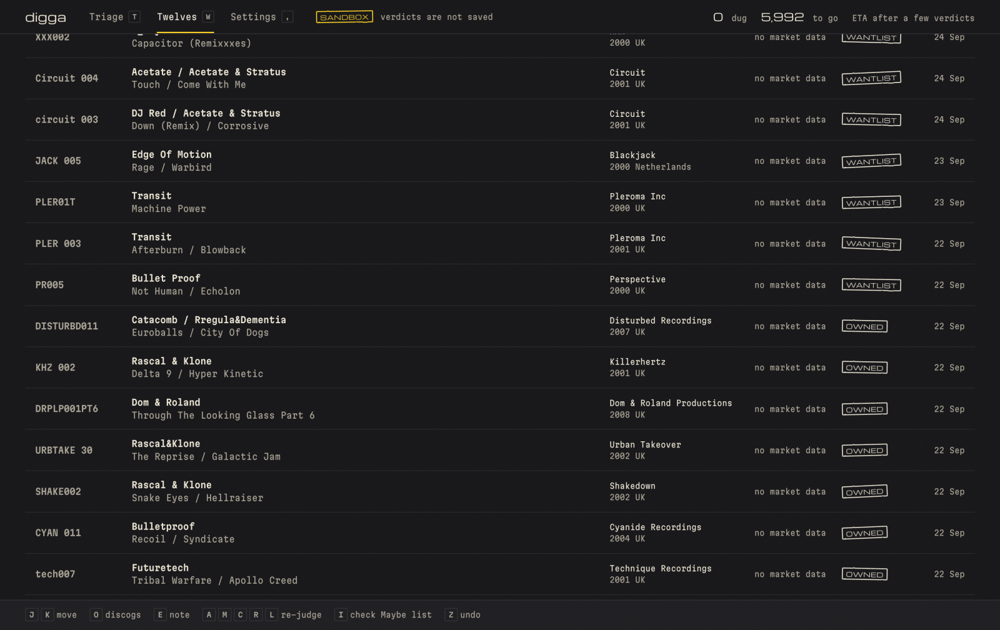
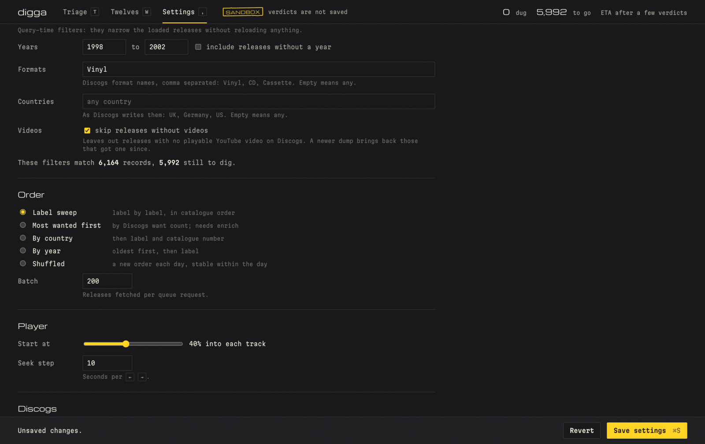

<p align="center">
  <picture>
    <source media="(prefers-color-scheme: dark)" srcset="docs/assets/digga-mole-dark.png">
    <source media="(prefers-color-scheme: light)" srcset="docs/assets/digga-mole-light.png">
    
  </picture>
</p>

# Digga

**Dig Discogs by ear.**

Digga is a local-first app for digging through Discogs records by ear. Choose the styles and years
you care about, load the releases, then listen to a few seconds of each record and decide with one
key. It keeps track of what you have heard, what you want, and what is still waiting.

Use it to build a DJ wantlist, work through a label's back catalogue, or find a tune you remember
from an old radio set but never knew the name of. The defaults focus on late-1990s and early-2000s
drum & bass; the styles, years, and formats are yours to change.

**Digga is the app. Your twelves are what it finds.**

## Listen, decide, move on

Triage puts the release details, tracklist, and YouTube player on one screen. Tracks start partway
through, at a position you choose, and the next track and the next release are preloaded while you
listen. Mark a
record as a want, skip it, flag a grail, or leave it for later. Undo walks back through your session.



| Key       | Action                                                  |
| --------- | ------------------------------------------------------- |
| `Space`   | Play or pause                                           |
| `J` / `K` | Next or previous track                                  |
| `←` / `→` | Seek backward or forward                                |
| `A`       | Want                                                    |
| `R`       | Skip                                                    |
| `C`       | Grail: a top want or the tune you have been hunting     |
| `L`       | Snooze for another listening session                    |
| `N`       | Move on without a verdict; keep the record in the queue |
| `X`       | Hide the record's label from the queue                  |
| `E`       | Note on the record, saved with its verdict              |
| `Z`       | Undo                                                    |
| `?`       | Show the keys for the current page                      |

You can also mark individual tracks, jump to a percentage of a video, and open the release on
Discogs. Records play the videos of all their pressings. When nothing plays, `S` searches
YouTube; copy a video's link, press `⌘V` in Digga, and it is attached to the release and plays. See the [full keymap](docs/KEYMAP.md).

## Keep your finds in Twelves

Twelves brings together your wants, grails, maybes, snoozed records, and imported Discogs wantlist
and collection. Filter and sort the shelves, add notes, change a verdict, or return to snoozed
records for another listen. The Tracks shelf lists every track you marked grail or keep, with a
note of its own.



With sandbox mode off and your Discogs account configured, `A` and `C` add a record to your Discogs
wantlist, with the tracks you marked and your note as the want's note. A grail stays a grail in
Digga. Undo reverses the addition. If you use a Discogs Maybe list, select it in Settings to
enable `M`. Digga records maybes locally; adding them to the Discogs list is manual.

## Choose what to dig

Settings controls the styles, years, formats, and countries in your queue, plus whether to skip
releases without videos. Format details such as `Unofficial Release` or `Compilation` can leave
records out, and so can hidden labels; `X` in Triage hides the label on screen, and `Z` brings it
back. Sweep label by label in catalogue order, start with the most wanted
records, browse by country or year, or use a daily shuffle. Set where playback starts and how far
the seek keys jump.



Imports of your collection, wantlist, and browser history can keep records you already know out
of the queue. The session counter shows how many you have judged, how many remain, and an estimated
time to finish once you have a listening pace.

## What stays local

Digga runs on your computer and opens in a browser. The catalogue and saved listening decisions
live in a local SQLite database. Playback uses YouTube, and account imports, fresh release data,
and wantlist updates use Discogs, so those features need an internet connection.

**New installations start in sandbox mode.** Verdicts, notes, track marks, and listens stay in the
current browser tab, and Digga does not change your Discogs wantlist. Sandbox decisions are
discarded when you leave that mode. Settings and setup jobs, including dump loading, enrichment,
and collection, wantlist, and history imports, still write local data.

When you are ready to keep your listening decisions, turn off sandbox mode in Settings. A Discogs
token is needed for wantlist updates, but your catalogue and verdicts remain local.

## Run Digga

Use **Node.js 24.11+ on the 24.x line** and npm. Vite+ is installed with the project, so the commands
below do not need a global `vp` installation.

### 1. Install and configure

From a fresh checkout:

```sh
git clone https://github.com/razorjack/digga.git
cd digga
npm install
cp .env.example .env
cp digga.config.example.json digga.config.json
```

Edit `digga.config.json` before loading the catalogue. The [example config](digga.config.example.json)
contains these settings:

- `universe.styles` selects the styles to import. Use Discogs' exact names, such as
  `Drum n Bass`.
- `universe.loadYears` limits the years imported into the local database. The example uses
  `[1994, 2008]`; `null` loads all years for the selected styles.
- `universe.coverage` also imports releases in other styles from the labels and artists of the
  records you want or own, when those labels and artists mostly release the selected styles.
- `filters` narrows what you listen to from the loaded catalogue. The example starts with vinyl
  from 1998 through 2002. These filters can change in Settings without loading the dump again.
- `discogs.username` is the account to use for collection and wantlist imports.

To update your Discogs wantlist or read private account data, create a personal access token in
[Discogs Settings → Developers](https://www.discogs.com/settings/developers) and paste it into
Settings in Digga, or set `DISCOGS_TOKEN` in `.env`. Use a token from the same account as
`discogs.username`.

The config file, `.env`, and `data/` are gitignored. If you do not copy the example config,
Digga creates one on the first command that needs it.

### 2. Load the catalogue

Digga reads the monthly **releases** dump, `discogs_YYYYMMDD_releases.xml.gz`, from
[Discogs data dumps](https://data.discogs.com/). The download is over 10 GB. Digga streams the
compressed file, so you do not need to extract it. Settings has buttons for both steps under
Jobs; from the command line:

```sh
npm run digga -- dump update      # both steps below: download unless it is there, then load
npm run digga -- dump download    # the newest dump into data/dumps/, checked against its checksum
npm run digga -- dump load data/dumps/discogs_YYYYMMDD_releases.xml.gz
```

Discogs publishes a new dump at the start of each month. Run the update again then: it loads the
records Discogs has added since, and `F` in Triage digs just those.

The loader keeps releases matching your import settings. Changing queue filters later is
immediate; expanding the imported styles or year range requires another dump load.

### 3. Import what you already know (optional)

With your Discogs username configured:

```sh
npm run digga -- import collection
npm run digga -- import wantlist
```

To mark previously visited Discogs releases as seen, import browser history:

```sh
npm run digga -- import history --browser brave
```

Chrome and Firefox are also supported via `--browser chrome` or `--browser firefox`. Use
`--path /path/to/History` to read a copied history database. Only import history if you want
previously visited releases excluded from the listening queue.

Fetch prices, have/want counts, and refreshed video links for the next 200 records:

```sh
npm run digga -- enrich --ahead 200
```

Enrichment is optional for listening to video links already present in the dump. While you dig,
Triage also enriches the next five records as they come up (`Enrich ahead` in Settings). The "most
wanted first" order needs the whole queue enriched: `enrich --all` fetches every record still to
dig, about one a second. These setup
jobs are also available in Settings.

### 4. Build and start

```sh
npm run build
npm run serve
```

Keep the server running and open **[http://localhost:3456](http://localhost:3456)**. Use
`localhost`: some YouTube videos refuse to play when the page is opened at `127.0.0.1`.
Press `Space` to start listening, try the verdict keys in sandbox mode, then turn sandbox off in
Settings when you want your decisions saved.

On later runs, `npm run serve` is enough. Rebuild after updating the frontend.

## Useful commands

| Command                               | Purpose                                                   |
| ------------------------------------- | --------------------------------------------------------- |
| `npm run digga -- stats`              | Show catalogue size, verdicts, remaining records, and ETA |
| `npm run digga -- enrich --ahead 200` | Refresh data for the next queue items                     |
| `npm run digga -- enrich --all`       | Fetch data for every record still to dig                  |
| `npm run digga -- enrich --twelves`   | Refresh prices of the records in Twelves                  |
| `npm run digga -- import list`        | Import the Maybe list selected in Settings                |
| `npm run digga -- backup`             | Copy the database into `data/backups` now                 |
| `npm run digga -- serve --port 3457`  | Use a different port                                      |
| `npm run digga -- help`               | Show every CLI command and option                         |

The database is stored in `data/digga.sqlite`. The server copies it into `data/backups` once a day
and keeps the last five; Settings also exports your verdicts and track marks as JSON or CSV. Set `DIGGA_DATA_DIR` or `DIGGA_CONFIG_FILE`
to use a different data directory or config file.

## Development

Run the API server and frontend dev server in separate terminals:

```sh
npm run serve
```

```sh
npm run dev
```

Open [http://localhost:5173](http://localhost:5173). The dev server proxies API requests to the
backend on port 3456.

```sh
npm run verify
```

This runs formatting, lint, type checks, tests, the portability checks, and Svelte checks. The
frontend uses Svelte 5; the server uses Hono and SQLite. Node runs the server's TypeScript sources
directly.

Digga currently runs as a local server and browser app. Electron packaging is planned.

- [Architecture](docs/ARCHITECTURE.md) and [data model](docs/DATA_MODEL.md)
- [Discogs and YouTube integration notes](docs/DISCOGS_NOTES.md)
- [Design brief](docs/DESIGN_BRIEF.md) and [decisions](docs/DECISIONS.md)
- [Roadmap](docs/ROADMAP.md) and [Electron plan](docs/ELECTRON_PLAN.md)
- [Contributor guide](CLAUDE.md)
