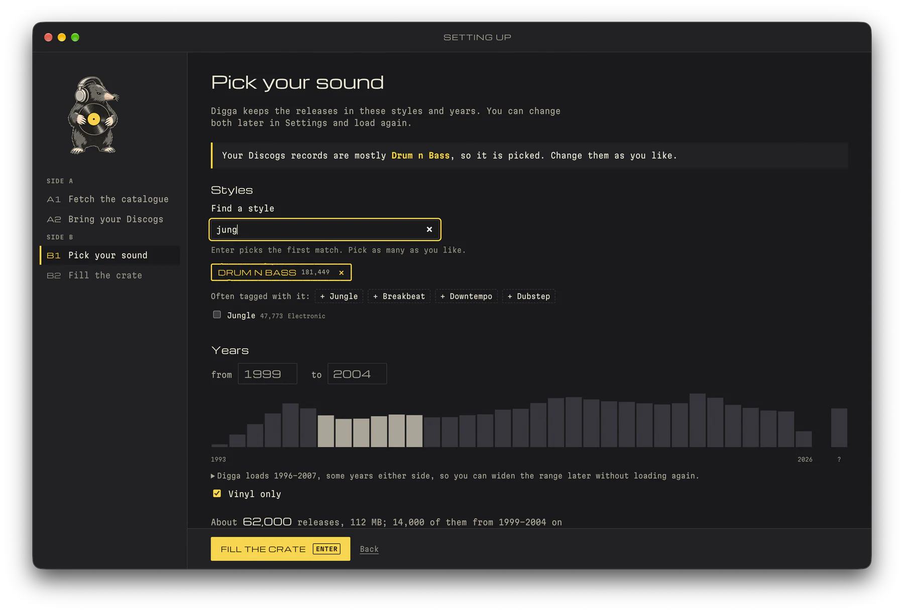
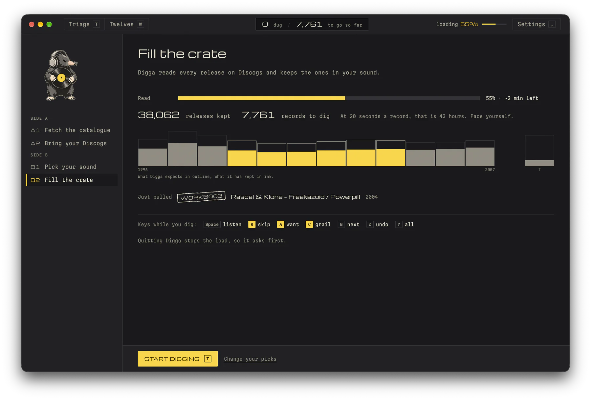

<p align="center">
  <picture>
    <source media="(prefers-color-scheme: dark)" srcset="docs/assets/digga-mole-dark.png">
    <source media="(prefers-color-scheme: light)" srcset="docs/assets/digga-mole-light.png">
    
  </picture>
</p>

# Digga

**Dig Discogs by ear.**

Digga is a local-first app for digging through Discogs records by ear. Choose the styles and years
you care about, load the releases, then listen to a few seconds of each record and decide with one
key. It keeps track of what you have heard, what you want, and what is still waiting.

Use it to build a DJ wantlist, work through a label's back catalogue, or find a tune you remember
from an old radio set but never knew the name of. The defaults focus on late-1990s and early-2000s
drum & bass; the styles, years, and formats are yours to change.

**Digga is the app. Your twelves are what it finds.**

## Listen, decide, move on

Triage puts the release details, tracklist, and YouTube player on one screen. Tracks start partway
through, at a position you choose, and the next track and the next release are preloaded while you
listen. Mark a
record as a want, skip it, flag a grail, or leave it for later. Undo walks back through your session.


| Key       | Action                                                  |
| --------- | ------------------------------------------------------- |
| `Space`   | Play or pause                                           |
| `J` / `K` | Next or previous track                                  |
| `←` / `→` | Seek backward or forward                                |
| `A`       | Want                                                    |
| `R`       | Skip                                                    |
| `C`       | Grail: a top want or the tune you have been hunting     |
| `L`       | Snooze for another listening session                    |
| `N`       | Move on without a verdict; keep the record in the queue |
| `X`       | Hide the record's label from the queue                  |
| `E`       | Note on the record, saved with its verdict              |
| `Z`       | Undo                                                    |
| `?`       | Show the keys for the current page                      |

You can also mark individual tracks, jump to a percentage of a video, and open the release on
Discogs. Records play the videos of all their pressings. When nothing plays, `S` searches
YouTube; copy a video's link, press `⌘V` in Digga, and it is attached to the release and plays. See the [full keymap](docs/KEYMAP.md).

## Keep your finds in Twelves

Twelves brings together your wants, grails, maybes, snoozed records, and imported Discogs wantlist
and collection. Filter and sort the shelves, add notes, change a verdict, or return to snoozed
records for another listen. The Tracks shelf lists every track you marked grail or keep, with a
note of its own.


With your Discogs account configured, `A` and `C` add a record to your Discogs
wantlist, with the tracks you marked and your note as the want's note. A grail stays a grail in
Digga. Undo reverses the addition. If you use a Discogs Maybe list, select it in Settings to
enable `M`. Digga records maybes locally; adding them to the Discogs list is manual.

## Choose what to dig

Settings controls the styles, years, formats, and countries in your queue, plus whether to skip
releases without videos. Format details such as `Unofficial Release` or `Compilation` can leave
records out, and so can hidden labels; `X` in Triage hides the label on screen, and `Z` brings it
back. Sweep label by label in catalogue order,
browse by country or year, or use a daily shuffle. Set where playback starts and how far
the seek keys jump.


Imports of your collection, wantlist, and browser history can keep records you already know out
of the queue. The session counter shows how many you have judged, how many remain, and an estimated
time to finish once you have a listening pace.

## What stays local

Digga runs on your computer and opens in a browser. The catalogue and saved listening decisions
live in a local SQLite database. Playback uses YouTube, and account imports, fresh release data,
and wantlist updates use Discogs, so those features need an internet connection.

Verdicts, notes, track marks, and listens are saved from the first one. `Z` undoes the last
verdict, and takes a want back off your Discogs wantlist; Twelves lets you judge a record again.
A Discogs token is needed for wantlist updates, but your catalogue and verdicts remain local.

## Run Digga

Use **Node.js 24.11+ on the 24.x line** and npm. Vite+ is installed with the project, so the commands
below do not need a global `vp` installation.

### 1. Install and start

```sh
git clone https://github.com/razorjack/digga.git
cd digga
npm install
npm run build
npm run serve
```

Keep the server running and open **[http://localhost:3456](http://localhost:3456)**. Use
`localhost`: some YouTube videos refuse to play when the page is opened at `127.0.0.1`. On later
runs, `npm run serve` is enough. Rebuild after updating the frontend.

### 2. Follow the setup

A new library opens the setup, which takes about 20 minutes, most of it waiting:

1. **Fetch the catalogue.** Digga downloads the newest monthly releases dump,
   `discogs_YYYYMMDD_releases.xml.gz` from [Discogs data dumps](https://data.discogs.com/), about
   10.5 GB, and checks it against the checksum Discogs publishes. The first screen says how big it
   is and how much space the disk has before anything downloads.
2. **Bring your Discogs** (optional). Paste a personal access token from
   [Discogs Settings → Developers](https://www.discogs.com/settings/developers); Digga takes your
   username from it. It then imports your collection and wantlist, so records you own or want stay
   out of the queue, and it can mark the releases you opened on discogs.com in Brave, Chrome or
   Firefox as seen. Without a token, your username reads a public collection and wantlist.
3. **Pick your sound.** Every Discogs style, with its size, and the years to dig, over a histogram
   of their releases. Styles your Discogs records mostly carry are picked already, and the estimate
   says how many releases the picks come to.
4. **Fill the crate.** The load reads the dump while it downloads, and keeps the releases in your
   styles and years. It takes 15 to 20 minutes, but records arrive from the first seconds:
   "Start digging" lights up once 500 wait, and the header shows the load while you dig.





Start digging digs for real, so your verdicts are kept from the first one.

### Where Digga keeps things

Digga keeps its library in a folder of your user account: `~/Library/Application Support/Digga`
on macOS, `%APPDATA%\Digga` on Windows and `~/.config/Digga` on Linux. It holds the database, its
daily backups, your settings in `digga.config.json` and the Discogs token you save in Settings.
Dumps go in the cache folder, which backups skip: `~/Library/Caches/Digga/dumps`,
`%LOCALAPPDATA%\Digga\Cache\dumps` or `~/.cache/Digga/dumps`. `npm run serve` prints both.

To keep the library elsewhere, set `DIGGA_DATA_DIR`, and `DIGGA_DUMPS_DIR` or
`DIGGA_CONFIG_FILE` if needed, in the environment or in a `.env` in the folder you run Digga from
([`.env.example`](.env.example) lists them). A library placed with `DIGGA_DATA_DIR` keeps its
dumps inside it unless `DIGGA_DUMPS_DIR` says otherwise. `DIGGA_DUMPS_DIR` also puts the dumps on
another disk when the one with the cache folder is short of space.

### Digga and the Discogs API

Digga reads the catalogue from the dump, not through your account. It uses the token only for
things you do, one request at a time:

- your account: when you connect, and each time you open Settings, which shows whose token is
  saved and offers your lists for the Maybe list, about two requests a visit;
- your collection and wantlist: one request per 100 records, when you import them;
- the Maybe list: when you import it, or press `I` in Twelves;
- a want: one request 1.5 s after `A` or `C`, and one more when `Z` takes it back, and in Twelves
  when you re-judge a want onto or off the wantlist;
- a price: one request when you press `P`, for the record on screen;
- a seller's shop: one request per 100 listings, when you read it.

Digga leaves 1.1 s between requests, which keeps it under Discogs' limit of 60 a minute. It
pauses when Discogs says the limit is nearly used, and waits as long as Discogs asks when it says
too many. Nothing runs in the background. Digga never changes your collection or lists, and never
reads orders or messages. A Discogs token cannot be limited to some actions, so Digga saves it
only on this computer, in `secrets.env` in the library folder (or reads `DISCOGS_TOKEN` from the
environment), and sends it only to api.discogs.com. You can revoke it on discogs.com at any time.

### Settings and the config file

Settings changes everything the setup chose, and `digga.config.json` holds it:

- `universe.styles` selects the styles to load, by Discogs' exact names, such as `Drum n Bass`.
- `universe.loadYears` limits the years loaded into the library. The setup loads three years more
  on each side of the years you dig; `null` loads all years for the selected styles.
- `universe.coverage` also loads releases in other styles from the labels and artists of the
  records you want or own, when those labels and artists mostly release the selected styles.
- `filters` narrows what you listen to from the loaded catalogue. These filters change in
  Settings without loading the dump again.
- `discogs.username` is the account to use for collection and wantlist imports.

Changing the queue filters is immediate; loading more styles or years takes another dump load.
Discogs publishes a new dump at the start of each month. "Update from the newest dump" in
Settings, under Library, loads it: it adds the records Discogs has added since, and `F` in Triage
digs just those. Settings also lists the dumps in the folder, says which one the library came
from, and deletes the ones you no longer want, about 10 GB each.

The dump has no prices or have/want counts. When a record might be worth buying, press `P` in
Triage and Digga asks Discogs for them. The same request brings the release's current videos, so a
track whose video was added to Discogs after the dump becomes playable.

### From the command line

Every setup step also runs from the command line:

```sh
npm run digga -- dump update      # download the newest dump unless it is there, then load it
npm run digga -- dump download    # the newest dump into the dumps folder, checked against its checksum
npm run digga -- dump load ~/Library/Caches/Digga/dumps/discogs_YYYYMMDD_releases.xml.gz
npm run digga -- import collection
npm run digga -- import wantlist
npm run digga -- import history --browser brave   # also chrome or firefox; --path reads a copy
```

To rehearse the setup without downloading from Discogs, serve a dump you have with
`node tools/dev/fake-services.ts <dump.xml.gz>`, which also fakes the Discogs API (token
`e2e-token-dj`) and YouTube's oEmbed. Start Digga with the three addresses it prints
(`DIGGA_DUMPS_URL`, `DIGGA_DISCOGS_API_URL`, `DIGGA_YOUTUBE_OEMBED_URL`) and a throwaway
`DIGGA_DATA_DIR` and `DIGGA_DUMPS_DIR`.

## Useful commands

| Command                              | Purpose                                                   |
| ------------------------------------ | --------------------------------------------------------- |
| `npm run digga -- stats`             | Show catalogue size, verdicts, remaining records, and ETA |
| `npm run digga -- import list`       | Import the Maybe list selected in Settings                |
| `npm run digga -- backup`            | Write both backups now (see below)                        |
| `npm run digga -- restore <file>`    | Restore a backup (see below)                              |
| `npm run digga -- serve --port 3457` | Use a different port                                      |
| `npm run digga -- help`              | Show every CLI command and option                         |

## Your decisions and their backups

Discogs only learns about your wants and grails, through your wantlist. Every skip, maybe,
snooze, note, track mark and tune you heard exists only in Digga's database on your computer, so
Digga backs them up every day. Both kinds of backup go to the `backups` folder in the library
folder:

| System  | Backups folder                                                          |
| ------- | ----------------------------------------------------------------------- |
| macOS   | `~/Library/Application Support/Digga/backups`                           |
| Windows | `%APPDATA%\Digga\backups`                                               |
| Linux   | `~/.config/Digga/backups`, or `$XDG_CONFIG_HOME/Digga/backups` when set |

With `DIGGA_DATA_DIR` set, it is `backups` in that folder. Settings shows the path on its
**Backups** tab.

- **`decisions-YYYY-MM-DD.json.gz`: your decisions.** Every verdict, your notes and track marks,
  the tunes you heard and every listen, the YouTube links you attached, the videos a record marked
  "no audio" had, the history of every decision, your recent digging sessions and your settings.
  Your imported wantlist, collection and Maybe list are in it too. Release details are not: the
  Discogs ids find them again. Digga keeps the last 30. A day on which nothing changed adds no
  file, so they cover your last 30 days of digging, and a library with nothing decided in it yet
  writes none. A library with 40,000 decisions, 120,000 logged changes to them and 300,000 listens
  writes about 17 MB.
- **`digga-YYYY-MM-DD.sqlite`: the whole database.** Digga keeps the last two. It restores
  everything with one command, but is 100 MB or more.

The server writes both when it starts, and again each day while it runs. `npm run digga -- backup`
writes both at once.

`gunzip -c decisions-2026-09-30.json.gz` shows what a decisions backup holds: a header line, then
one record per line, each naming its kind in `record`. Here, Stakka & Skynet's _Clockwork_ is a
want, and _Crime Audio_ by Item A La Playa is a grail, marked on its track (lines shortened):

```json
{"app":"digga","kind":"decisions","version":3,"backedUpAt":"2026-09-30T21:04:12.518Z","dataHash":"9c41…","config":{…}}
{"record":"verdict","key":"m:34620","status":"accepted","source":"triage","releaseId":8667,"decidedAt":"2026-09-30T20:41:07.332Z","updatedAt":"2026-09-30T20:41:07.332Z"}
{"record":"verdict","key":"r:620767","status":"candidate","source":"triage","releaseId":620767,"decidedAt":"2026-09-30T20:52:39.905Z","updatedAt":"2026-09-30T20:52:39.905Z"}
{"record":"trackMark","releaseId":620767,"position":"A","mark":"candidate","notes":null,"decidedAt":"2026-09-30T20:52:31.118Z","heardKey":"item a la playa - crime audio",…}
{"record":"heardTune","heardKey":"stakka and skynet - clockwork","firstReleaseId":8667,"secondsListened":14.2,…}
{"record":"listen","eventId":"3f0c…","releaseId":8667,"position":"A","videoId":"…","seconds":14.2,…}
```

- `key` is the record: `m:` and a Discogs master id, like
  [discogs.com/master/34620](https://www.discogs.com/master/34620), or `r:` and a release id for a
  release without a master, like
  [discogs.com/release/620767](https://www.discogs.com/release/620767).
- `status` is the verdict: `accepted` (want), `candidate` (grail), `rejected` (skip), `maybe`,
  `snoozed` or `no_audio`, or `seen` from the browser history import. A record you skipped looks
  the same with `"status":"rejected"`. What your Discogs collection, wantlist and Maybe list hold
  is in `memberships`, apart from your decisions.
- `source` is `triage` for a decision you made in Digga, or `seed:history` for a page the history
  import found.
- `releaseId` is the pressing you heard. Times are in UTC.

**To restore**, stop the server first. With a database copy, run
`npm run digga -- restore digga-YYYY-MM-DD.sqlite`, with a path or the name of a file in the
backups folder, and that is all. It keeps the database it replaces in the backups folder as
`before-restore-YYYY-MM-DD-HHMMSS.sqlite`, and upgrades a copy from an older Digga. The
`before-migration-<version>.sqlite` copy that Digga writes before a schema upgrade restores the
same way. Without a database copy:

1. Load the catalogue again: `npm run digga -- dump update`, or **Update from the newest dump** in
   Settings.
2. Run `npm run digga -- restore decisions-YYYY-MM-DD.json.gz`, with a path or the name of a file
   in the backups folder. It copies the database first, then merges the file in: each verdict and
   track mark keeps whichever side changed it last, so one you changed or deleted after the backup
   was written stays as it is. To go back to an earlier state, restore a database copy instead.
3. Import your collection and wantlist again, so what changed on Discogs since the backup
   applies.

Both backups live on the same disk as the library. To survive a lost disk, copy the decisions
files somewhere else, such as a cloud drive. Settings also exports your verdicts and track marks
as JSON or CSV, with artist, title and label, for reading outside Digga.

## Development

Run the API server and frontend dev server in separate terminals:

```sh
npm run serve
```

```sh
npm run dev
```

Open [http://localhost:5173](http://localhost:5173). The dev server proxies API requests to the
backend on port 3456. Both use your library; to develop against another one, set `DIGGA_DATA_DIR`
in `.env`.

```sh
npm run verify
```

This runs formatting, lint, type checks, tests, the portability checks, and Svelte checks. The
frontend uses Svelte 5; the server uses Hono and SQLite. Node runs the server's TypeScript sources
directly.

Digga currently runs as a local server and browser app. Electron packaging is planned.

- [Architecture](docs/ARCHITECTURE.md) and [data model](docs/DATA_MODEL.md)
- [Discogs and YouTube integration notes](docs/DISCOGS_NOTES.md)
- [Design brief](docs/DESIGN_BRIEF.md) and [decisions](docs/DECISIONS.md)
- [Roadmap](docs/ROADMAP.md) and [Electron plan](docs/ELECTRON_PLAN.md)
- [Contributor guide](CLAUDE.md)

## License

MIT; see [LICENSE](LICENSE).
